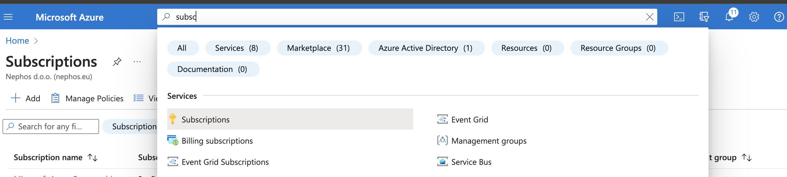
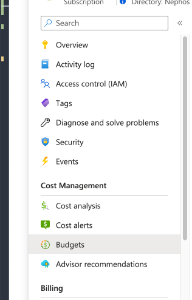
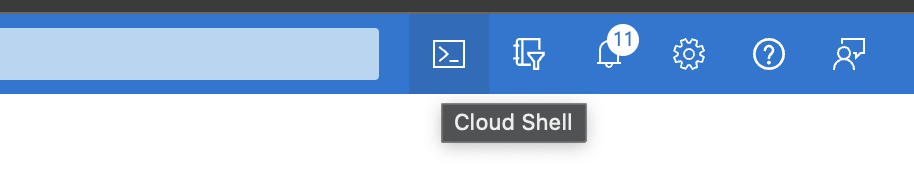
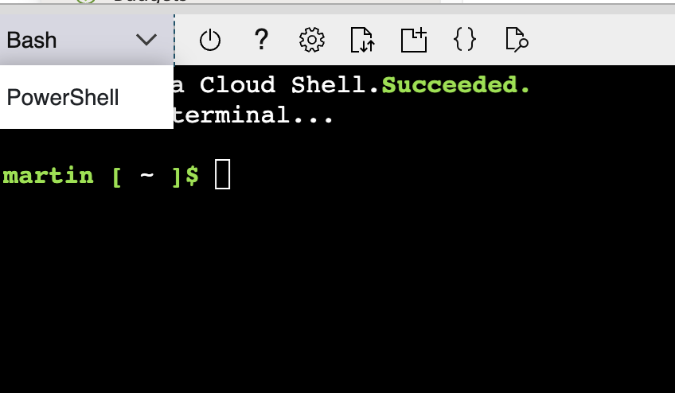
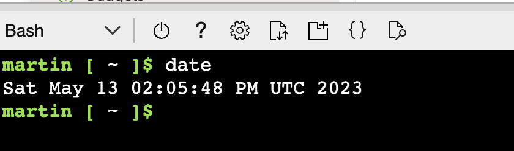

---
lab:
    title: '01 - How does Azure work?'
    module: 'Azure Core'
---

# Lab 01 - How does Azure work?

## Challenge scenario

You will learn fundamentals of Azure administration capabilities - get arround Azure portal

First try to solve the challenges on your own, in case you have trouble, click on the arrow left of the challenge for a detailed guide or ask facilitator for help.

## Objectives

In this lab, you will:

+ Learn about fundamentals of managing Azure

## Challenges

  
Login to Azure portal

1. Navigate to portal.azure.com
1. Login using provided credentials

  

  
Find information about your subscription (Subscription ID, Subscription Name) 

1. In the Azure portal, search for and select **Subscriptions**
   
   
   
1. Click on your subscription

  

  
Find what permission do you have in your subscription 

1. In the Azure portal, search for and select **Subscriptions**

   
 
1. Click on your subscription
1. Find "My permission"

  

  
Find budgets applied to your subscription 

1. In the Azure portal, search for and select **Subscriptions**
1. Click on your subscription
1. In the left menu, click on Budgets
   

  

  
Connect to cloud shell

1. In the Azure portal, click on the Cloud shell on the top right
   
   
   
   
   
1. Type "Date" to show system time
   
   

  

