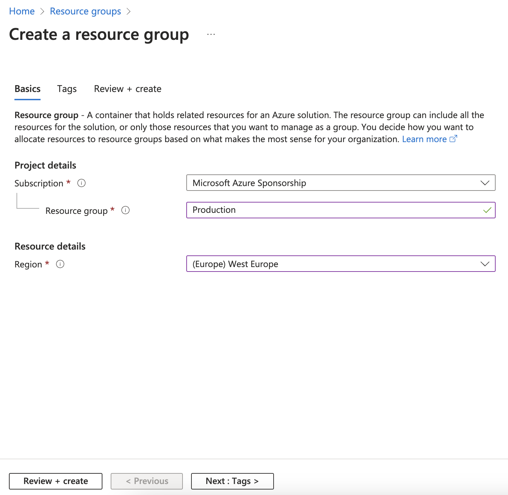
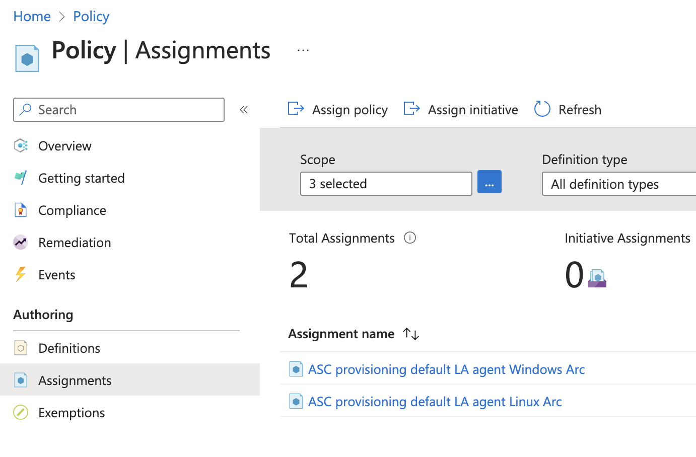
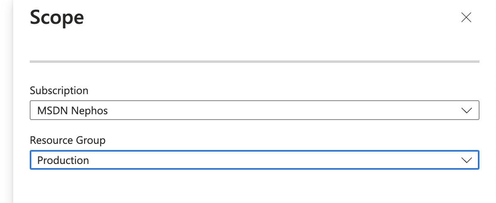
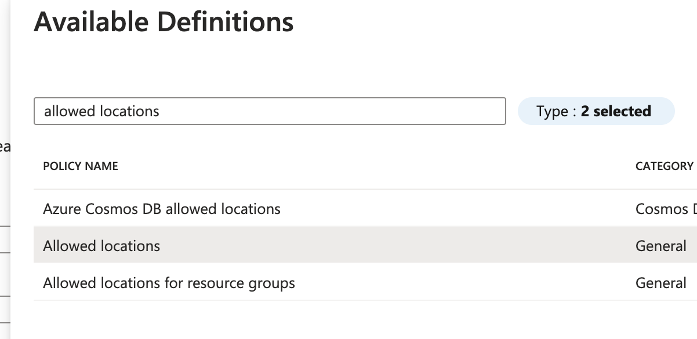

---
lab:
    title: '02 - Managing Azure'
    module: 'Azure Core'
---

# Lab 01 - Managing Azure?
# Student lab manual

## Challenge scenario

You will learn fundamentals of Azure administration capabilities - login to portal, create and manage resource groups and create and manage resources. 

## Objectives

In this lab, you will:

+ Create resource groups and deploy resources to resource groups
+ Use resource tags
+ Restrict deployment and deletion

## Challenges

  
Create 2 resource groups - Production (West Europe) and Test (North Europe)

#### Task 1: Create resource groups

In this task, you will use the Azure portal to create resource groups and create a disk in the resource group.

1. Sign in to the [**Azure portal**](http://portal.azure.com).

1. In the Azure portal, search for and select **Resource groups**, click **+ Create**:

1. Type resource group name ("Production") and select Region West Europe

1. Click **Review + Create** and then click **Create**.

    >**Note**: Wait until the resource group is created. This should take less than a minute.

1. Repeat for "Test" and deploy to North Europe

  
Tag a resource group with a tag Department "IT"

#### Task 2: Tag resource group

1. Open the resource group
1. Click Tags in the left menu
1. Type the following values

    |Name|Value|
    |---|---|
    |Department| IT |

1. Click Apply

  
Add a Storage account named "myfirststorageaccount" to Test resource group in North Europe

### Task 3: Create a storage account in Test resource group

1. In the Azure portal, search for and select **Storage accounts**, click **+ Create**. Add the following settings

    |Setting|Value|
    |---|---|
    |Resource group| **Test** |
    |Storage account name| **myfirststorageaccount** |
    |Region| **North Europe** |
    |Redindancy| **Localy redundant storage** |

1. Note that storage accounts have to be globally unique. Pick a new unique name

1. Click **Review + Create** and then click **Create**.

  
Create a policy to only allow West Europe resources to be deployed to Production resource group

1. In the Azure portal, search for and select **Policies**

1. Click Assignments and Assign Policy
1. Apply the following settings

    |Setting|Value|
    |---|---|
    |Scope| your subscription and "Production" resource group |
    |Policy definition| Search for "Allowed locations" |
    |Enforcement| Enabled |

    
    

1. Click Next and next, to enter Parameters

1. Select West Europe

1. Click Review + Create

  
Create a resource lock to disable deletion of Production resource group

1. On the **Production** resource group blade, click **Locks** then **+ Add** and specify the following settings:

    |Setting|Value|
    ---|---|
    |Lock name| **delete-lock** |
    |Lock type| **Delete** |

  
Move the storage account you created before to "Production" resource group 

1. In the Azure portal, search for and select **Storage accounts**
1. Select your storage account
1. Click Move and Move to another resource group

    

1. Select **Production** and click next and observe a failed validation

    

