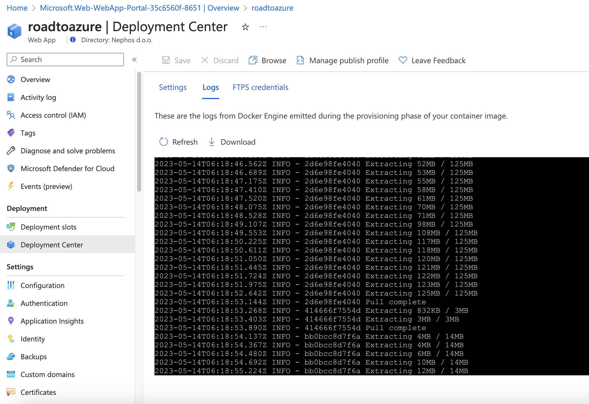
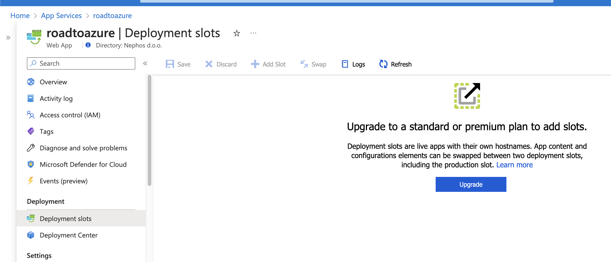
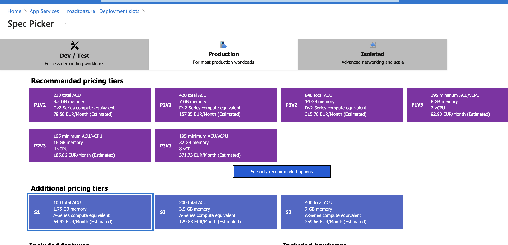
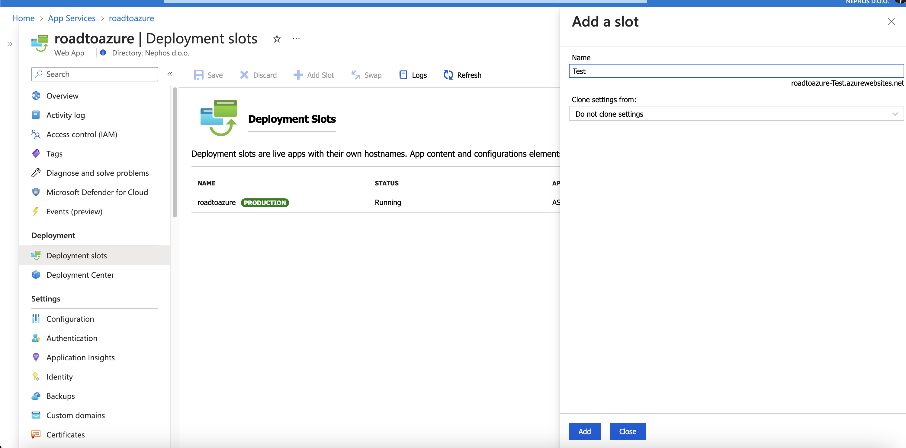
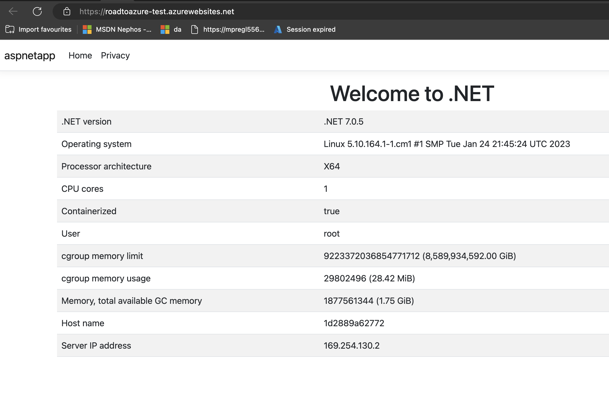
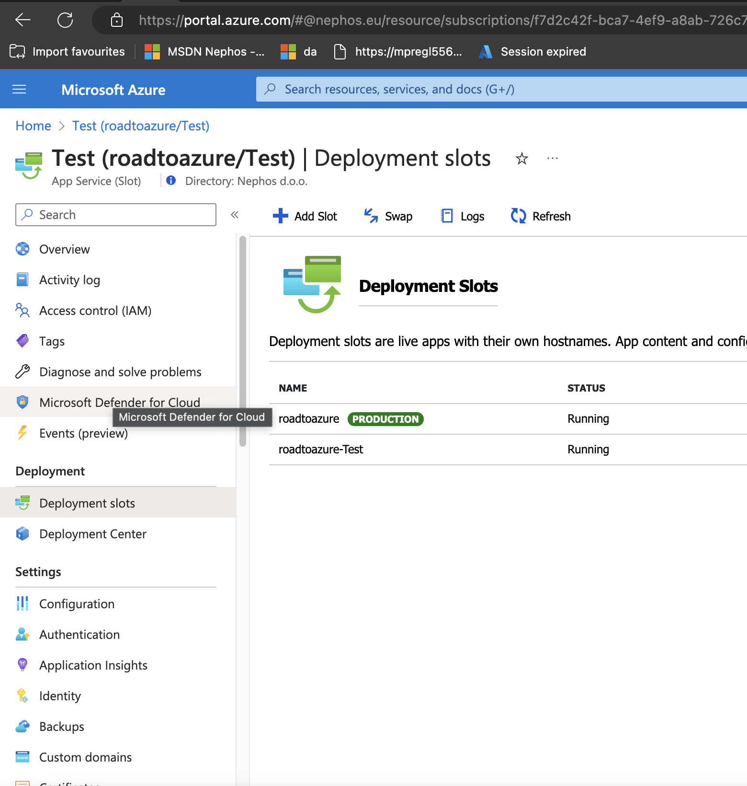
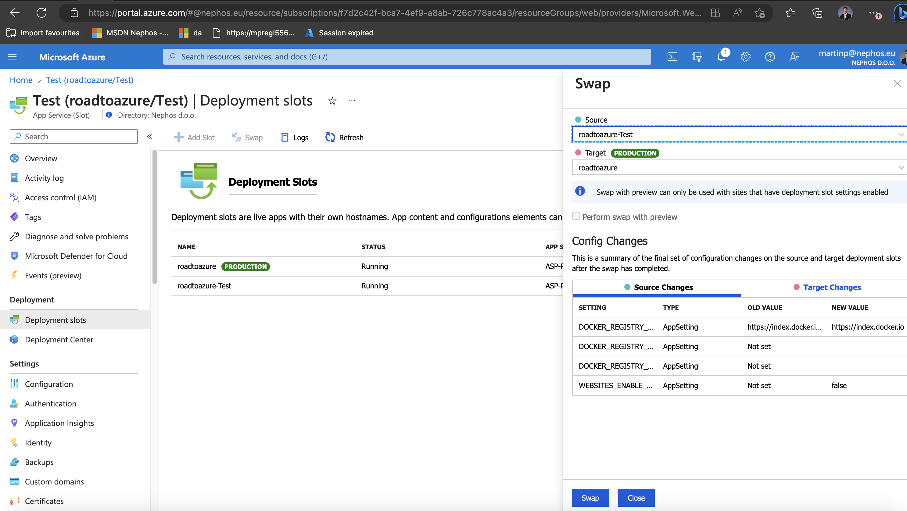
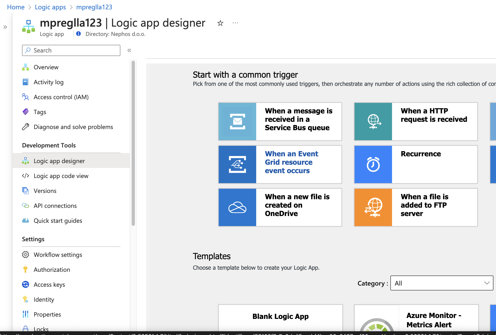
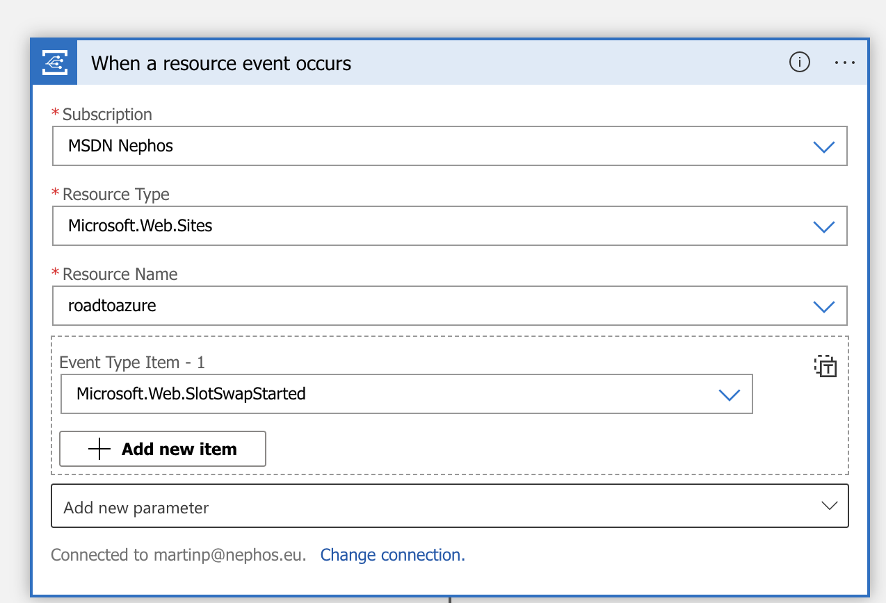
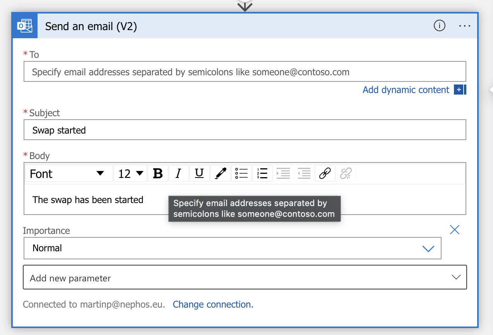

---
lab:
    title: '07 - Applications and Serverless'
    module: 'App services'
---

# Lab 07 - Applications and Serverless

## Challenge scenario

You will work with Platform as a service components of the Azure platform. Your goal will be to create all necessary components to host a website and scale it according to the load. You will also work with Serverless components

The solutions will not be provided - you should have enough experience by now to explore Azure Portal on your own. In case you do have trouble, there are some hints available, but you can also ask your facilitator for help.

## Objectives

In this lab, you will:

+ Create an app service and deploy a docker container
+ Create staging slot for test and swap to production
+ Create a simple Logic app that will send an email when the swap will take place

yeasy/simple-web:latest

## Challenges

### Challenge 1 - Our first web site

1. Create a new Resource Group "Web"
1. Create a new App Service

    |Name|Value|
    |---|---|
    |Name| (select a unique name)) |
    |Resource Group| Web |
    |Publish| Docker Container |
    |Region| West Europe |
    |Linux plan| F1 |

    Docker

    |Name|Value|
    |---|---|
    |Image Source| Docker Hub |
    |Image and Tag| yeasy/simple-web:latest |

1. Review + Create
1. Click on Logs in Deployment Center to view deplyoment progress
1. Test the website by opening the link

  
Hints

1. Create a new Resource Group "Web"
1. Create a new App Service

    
    

1. Review + Create
1. Click on Logs in Deployment Center to view deplyoment progress
    
1. Test the website by opening the link
    

  

### Challenge 2: create a Staging slot

1. Create a New Staging slot
1. First, upgrade from free toto S1 Tier (hidden under "See additional options") and click Apply
1. Create a new Deployment slot and call it "test"
1. Click on the slot and select Deployment Center

1. Deploy with docker image mcr.microsoft.com/dotnet/samples:aspnetapp
1. Click Save
1. Navigate to URL of the new Website
1. test the staging slot
1. Swap to test and production deployment slots

  
Hints

1. Create a New Staging slot
1. First, upgrade from free toto S1 Tier (hidden under "See additional options") and click Apply
  
  
1. Create a new Deployment slot and call it "test"
  
1. Click on the slot and select Deployment Center

1. Deploy with docker image mcr.microsoft.com/dotnet/samples:aspnetapp
  
1. Click Save
1. Navigate to URL of the new Website
  
1. test the staging slot
1. Swap to test and production deployment slots
  
  
  

  

### Challenge 3 - Get a Notification when swap occurs

1. Create a new Logic App

    |Name|Value|
    |---|---|
    |Resource Group| Web |
    |Name| (unique name) |
    |Region| West europe |
    |Plan| Consumption |

1. Select "Logic app designer"
1. Select "When an event grid resource event occurs"
1. Login if needed

1. In "When a resource event occurs" enter the following for trigger
    |Name|Value|
    |---|---|
    |Subscription| (select your subscription) |
    |Resource Type| Microsoft.Web |
    |Resource Name| (select your resource) |
    |Event Type| Microsoft.Web.SlotSwapStarted |

1. Click new Step
1. Search for "send Email v2"
1. Login with your Work Email
1. Add Subject "Swap Started"
1. Optionally, you can add dynamic content in Body

  
Hints

1. Create a new Logic App

  
  
   
   

  
